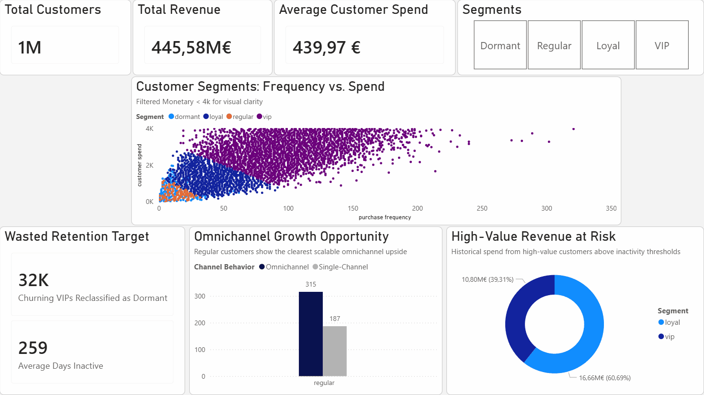
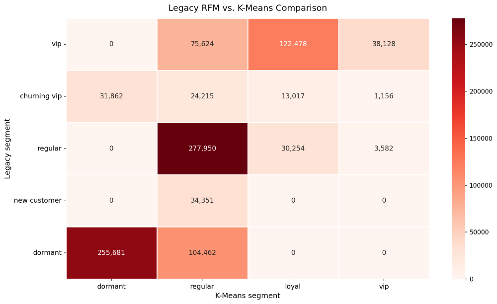

# Customer Segmentation for Business Decision-Making
### H&M Case Study | Business Analytics, SQL, Power BI, Python

## Executive Summary

I built this project to evaluate whether a legacy RFM-based segmentation was precise enough to support retention, targeting, and growth decisions. Using a 12‑month transaction window from the H&M dataset, I compared a rule-based RFM baseline with a behavioral K‑Means challenger across **1,012,760 customers**.

Key result: only **16.1%** of customers labeled as VIP by the legacy logic remained VIP under the behavioral segmentation, showing that premium targeting was being applied far too broadly.

I translated these differences into decision actions using DuckDB SQL and an executive Power BI dashboard, focusing on three priorities: reducing wasted retention spend, scaling omnichannel value in the Regular segment, and prioritizing early intervention for high-value customers at risk of inactivity.

## Business Problem

Rule-based customer segmentation is easy to implement, but it can become too broad for real commercial decisions. When premium, retention, and growth audiences are not well separated, businesses risk:

- overinvesting in low-recovery customers
- missing scalable growth opportunities in mid-value segments
- optimizing campaign volume instead of customer value

## Dataset and Scope

**Source:** H&M Personalized Fashion Recommendations (Kaggle)

I used three tables:
- `transactions_train.csv` for purchase history
- `customers.csv` for customer attributes
- `articles.csv` for product metadata

After cleaning and filtering the initial **31,788,324 raw transactions** to the most recent **12 months**, the final working scope included:
- **15,670,430** transactions in the analysis window
- **1,012,760** unique customers

## Analytical Approach

I structured the project as a business analytics workflow:

1. built customer-level **RFM** metrics over a relevant decision window
2. recreated a **legacy rule-based segmentation baseline**
3. added **K-Means** as a behavioral challenger to audit the baseline
4. used **DuckDB SQL** and **Power BI** to convert model differences into business actions

This approach keeps the analysis grounded in a familiar business framework while still testing whether customer behavior supports better decision-making.

## Key Findings

### 1) The legacy segmentation overstates premium value

The legacy RFM logic labeled **236,230 customers** as VIP, but only **38,128** remained VIP under the behavioral segmentation. In other words, only **16.1%** of legacy VIPs were still treated as true VIPs, while **83.9%** were reclassified into lower-priority groups.

The largest reclassifications were:
- **122,478** legacy VIPs moved to **Regular**
- **75,624** legacy VIPs moved to **Loyal**
- **38,128** remained **VIP**

The same issue appears in retention targeting. The rule-based model labeled **31,862 customers** as **churning VIP**, but the behavioral model classified them as **Dormant**. These customers had an average of **259 days since last purchase** and an average annual spend of **€469**.

**Why it matters:** premium and retention budgets are likely being spread too broadly.

**What I recommend:** tighten premium eligibility criteria and separate true high-value retention targets from low-recovery inactive customers.

**Expected outcome:** more precise targeting and lower waste in premium and retention campaigns.

### 2) Omnichannel behavior is linked to higher spend, especially in the Regular segment

The clearest scalable growth opportunity appears inside the **Regular** segment. Customers who purchased through more than one channel generated an average annual spend of **€315.32**, compared with **€186.82** for single-channel customers. That is a gap of **€128.50 per customer**.

This is commercially relevant because the segment is large:
- **357,264** Regular customers were single-channel
- **159,338** Regular customers were omnichannel

**Why it matters:** the next growth lever is not only acquisition. It is also better development of existing mid-value customers.

**What I recommend:** prioritize app adoption, click-and-collect journeys, and integrated promotions designed to move single-channel Regular customers into omnichannel behavior.

**Expected outcome:** higher average customer value and stronger upsell efficiency within the largest behavioral segment.

### 3) Retention risk should focus on VIP and Loyal customers above segment-specific inactivity thresholds

I used the **90th percentile of recency** within each segment as an inactivity warning threshold. On that basis, the priority retention audiences are **VIP** and **Loyal** customers.

- **VIP:** **4,246 customers**, threshold at **68 days**, **€10.80M** in historical revenue exposure
- **Loyal:** **16,418 customers**, threshold at **106 days**, **€16.66M** in historical revenue exposure

Together, these two segments represent **20,664 customers** and **€27.46M** in historical revenue exposure.

**Why it matters:** retention should be prioritized where both **value** and **recovery potential** are still meaningful.

**What I recommend:** trigger retention workflows for VIP and Loyal customers before they move beyond their segment-specific warning thresholds. Handle Regular customers mainly through activation, cross-sell, and omnichannel development rather than expensive rescue campaigns.

**Expected outcome:** earlier intervention on high-value customers and more efficient allocation of retention budget.

## Final K-Means Segment Mix

| Segment | Customers | Share |
|--------|-----------:|------:|
| Regular | 516,602 | 51.0% |
| Dormant | 287,543 | 28.4% |
| Loyal | 165,749 | 16.4% |
| VIP | 42,866 | 4.2% |

This distribution shows that most customers sit in the middle of the value curve. That makes prioritization critical: premium treatment, activation, and retention should not be applied evenly across the base.

## Power BI Dashboard Summary

The Power BI dashboard is the project’s executive delivery layer. It consolidates the segment mix, the legacy-versus-behavioral mismatch, the omnichannel spend gap, and high-value inactivity exposure into a single decision view.

The dashboard is designed to answer three business questions quickly:
- where customer value is being overstated
- where growth potential is strongest
- which customers should be prioritized first

The dashboard includes four navigable views and focuses on decision support rather than model diagnostics.

## Deliverables

This repository includes:
- a documented Jupyter notebook with the full analytical workflow
- curated parquet exports for reporting
- a Power BI dashboard for executive review
- business-ready segmentation logic and supporting insight tables

## Tools Used

- Python
- Pandas
- NumPy
- Scikit-learn
- DuckDB
- Matplotlib
- Seaborn
- Power BI

## Final Takeaway

This project demonstrates an **end-to-end analytical workflow**, showing how to audit and improve a legacy customer segmentation framework using behavioral analysis, SQL, and executive dashboarding. 

Ultimately, this repository reflects how I approach data to drive business value:
- **Framing** commercial problems into actionable analytical workflows. 
- **Building** customer-level metrics that support strategic decisions. 
- **Leveraging SQL** to answer targeted, high-impact business questions. 
- **Communicating** findings clearly through an executive dashboard.

The core value demonstrated here isn't about making segmentation more complex—it's about making customer decisions **more accurate, more targeted, and more commercially useful**.